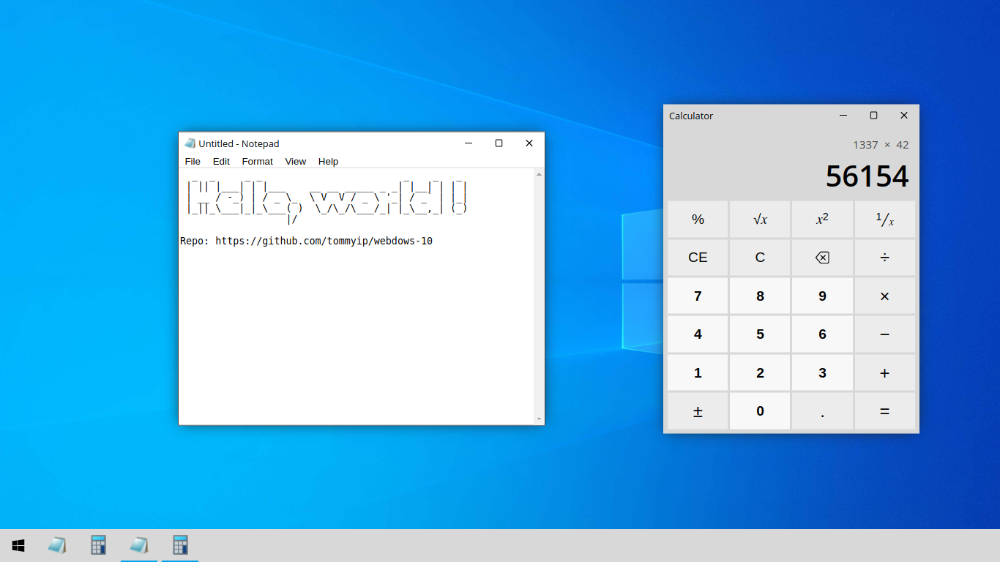

# Webdows 10

A subset of the Windows 10 UI implemented using Vue 3. *It is just a toy demo for me to play around with Vue 3, not intended for serious use.*

## Screenshot

## Status 

This project is still in its early stages, there are a lot of features yet to be implemented. Some of the todo items:

* Browser (should be capable of self-hosting webdows 10!)
* Implement all/most of Notepad's menu items
* Implement unary operators for Calculator
* Paint
* File system
